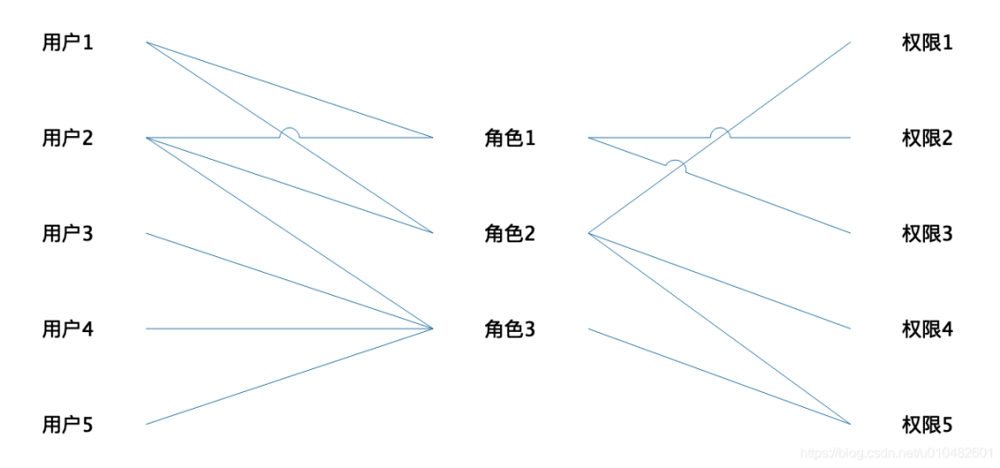

# RBAC是什么？
## RBAC的简单概念
RBAC，全称为 Role-Based Access Control，翻译过来叫基于角色的访问控制，通过将用户分配到不同的角色，并为角色分配权限，从而实现对资源的访问控制。




## RBAC中的组成部分

**角色（Role）**：角色是指在系统中具有一组相关权限的抽象概念，代表了用户在特定上下文中的身份或职能，例如管理员、普通用户等。

**权限（Permission）**：权限是指对系统资源进行操作的许可，如读取、写入、修改等。权限可以被分配给角色。

**用户（User）**：用户是指系统的实际使用者，每个用户可以被分配一个或多个角色。

**分配（Assignment）**：分配是指将角色与用户关联起来，以赋予用户相应的权限。

## RBAC中的组成部分的关系

RBAC 认为授权实际上是Who 、What 、How 三元组之间的关系，也就是Who 对What 进行How 的操作，也就是“主体”对“客体”的操作。

Who：是权限的拥有者或主体（如：User，Role）。

What：是操作或对象（operation，object）。

How：具体的权限（Privilege,正向授权与负向授权）。

# 如何实现RBAC?

首先我们要知道他的功能是什么：不要让实体之间产生直接依赖，而是通过抽象（角色/接口）进行关联。
而在以前的项目中，我常常使用**ACL (Access Control List, 访问控制列表)**。


# 在派聪明中关于RBAC权限管理的模块结构
````bash
src/ ├── main/ │ ├── java/com/yizhaoqi/smartpai/ │ │ ├── config/ # 配置类 │ │ │ ├── SecurityConfig.java │ │ │ ├── JwtAuthenticationFilter.java │ │ ├── controller/ # 控制器 │ │ │ ├── UserController.java │ │ ├── service/ # 服务层 │ │ │ ├── UserService.java │ │ │ ├── CustomUserDetailsService.java │ │ ├── repository/ # 数据访问层 │ │ │ ├── UserRepository.java │ │ ├── model/ # 数据模型 │ │ │ ├── User.java │ │ ├── utils/ # 工具类 │ │ │ ├── PasswordUtil.java │ │ │ ├── JwtUtils.java │ ├── resources/ │ ├── application.yml # 配置文件 └── test/ ├── java/com/yizhaoqi/smartpai/ ├── service/ # 测试类 ├── UserServiceTest.java
```

