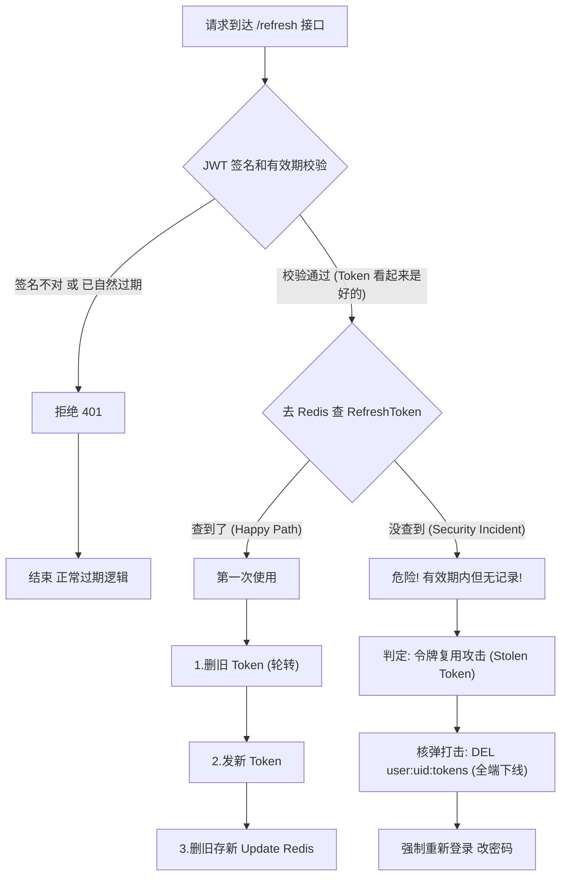

### 重放检测
[重放检测](重放检测.md)

### 轮转令牌
[轮转令牌](轮转令牌.md)

### 主要在哪个环节

主要在用户使用refresh_token来刷新登录的时候

### 我的理解

发来一条携带refresh的请求，如果我能在redis里面查到，就说明你是第一次拿这个refresh来更新，那么我重新生成Access和refresh给你，然后把旧的refresh和access在redis里面都删掉（这个操作应该就是轮转），这个时候有发来一个条请求，也是携带refresh，我的后端能够解析出来（如果是token过期那另当别论），说明这个token在之前生成的，在我的系统中，只要是生成过token我都会进行一次缓存，所以redis按道理应该会有记录，但是现在我没有看到记录，没有看到记录只有一种情况，就是你之前拿过这个refresh请求过我的系统，才会触发删除操作，所以我就可以判断你拿这的这个refresh是别人用过的，也就说明这个refresh是你偷来的，这个时候，我就把set集合里面所有数据都删除，并且我还让你重新登录，只有你知道密码我才能知道你是这个用户的主人。

### 流程图

