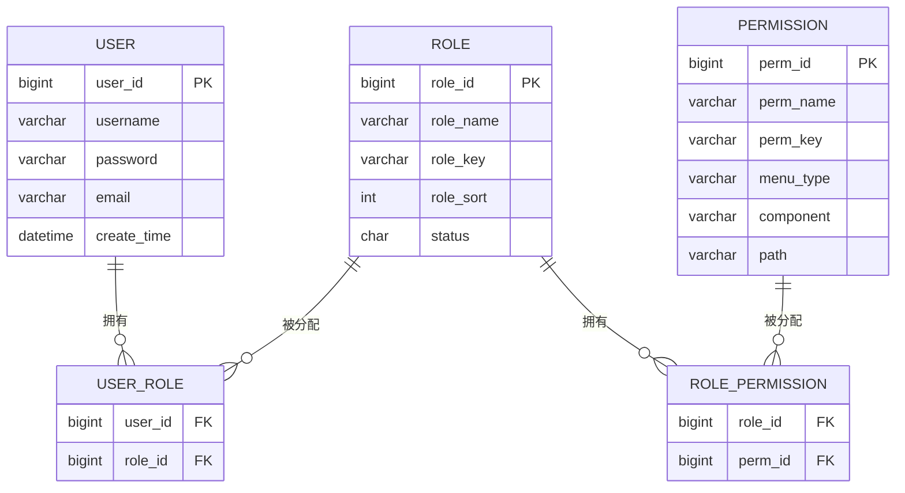

超级管理是如何给其他人赋予权力的？
# 资源表是如何权限绑定在一起的？

能不能看或者说，能不能进行增删改这个操作是由后端这个接口执不执行决定的，如果方法能够执行就说明该用户有这个权限，如果方法不能够执行就说明这个用户没有这个权限。

所以是通过方法是否执行来判断该用户是否有权限

在数据库中的映射是

但是落到具体的业务代码中，就是直接用户和权限连接在一起了，用户直接就可以映射权限


而权限的表达方式是一个一个字符串，有一点令牌的意思

| system:student:list   | 对student表查的权力    |
| --------------------- | ---------------- |
| system:student:add    | 对student表增的权力    |
| system:student:export | 对student表导出表格的权力 |
| system:student:query  | 等于student表查的权力   |
接下来我们看到这个接口，我们可以看到他直接把权限写在注解`@PreAuthorize("@ss.hasPermi('system:student:export')")  `
这上面了
```java
@PreAuthorize("@ss.hasPermi('system:student:export')")  
@Log(title = "学生信息", businessType = BusinessType.EXPORT)  
@PostMapping("/export")  
public void export(HttpServletResponse response, SysStudent sysStudent)  
{  
    List<SysStudent> list = sysStudentService.selectSysStudentList(sysStudent);  
    ExcelUtil<SysStudent> util = new ExcelUtil<SysStudent>(SysStudent.class);  
    util.exportExcel(response, list, "学生信息数据");  
}
```
这意味这个，只有当用户有这个令牌为`system:student:export`的时候 才能访问这个方法，这样通过方法是否执行来确定用户是否有权限